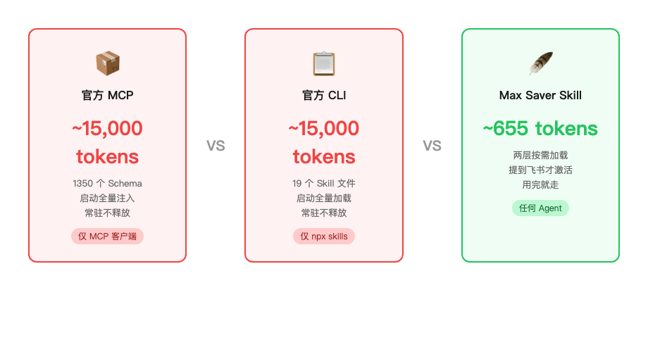
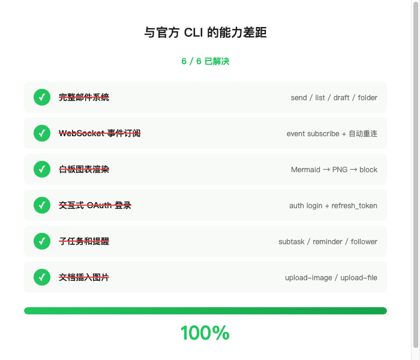

# 飞书出了官方 CLI，但我还是更爱自己的 Skill——怒省 96% 上下文

**一句话版：** 146 个飞书 API，655 tokens 上下文，不绑任何 Agent 框架。官方列出的 6 个能力差距，全部补齐。

---

15,000 tokens。

这是你的 Agent 接入飞书后，还没干活就先烧掉的上下文预算。

飞书官方 MCP 有 1350 个工具定义。每个都是一份 JSON Schema，连接时全量注入上下文。你的 Agent 打开飞书这把"瑞士军刀"，刀还没拔出来，口袋已经空了一大半。

15,000 tokens 什么概念？系统提示、用户历史、其他工具、代码片段一叠加，留给飞书的可能就几万 token。这不是理论数字——它直接挤压 Agent 处理复杂任务的空间。上下文窗口再大，也经不住这么烧。

上周飞书开放平台发了官方 CLI（github.com/larksuite/cli），3 天 1657 Star。我认真研究了一圈：200+ 命令，三层架构，19 个 Skill 文件，2500+ 原始 API。做得确实扎实。

然后我算了笔账。

## 一笔让人坐不住的 Token 账

| 方案 | 上下文成本 | 能用的 Agent | 加载方式 |
|------|-----------|-------------|---------|
| 飞书官方 MCP（1350+ 工具） | 🔴 ~15,000+ tokens | 仅 MCP 客户端 | 启动全量加载 |
| 飞书官方 CLI（19 个 Skill 文件） | 🔴 ~15,000+ tokens | 仅 npx skills 框架 | 启动全量加载 |
| **Feishu Max Saver Skill** | 🟢 **~655 tokens** | **任何 Agent** | **按需触发** |

655 vs 15,000。省 96%。146 个 API 端点，上下文成本差了 23 倍。



## 三刀砍到 655

**第一刀：两层加载。**

不一次灌完。SKILL.md 只放能力概览和常用命令模式，大约 655 tokens，日常常驻。100+ 条完整命令参考单独放在 `references/commands.md`，Agent 需要具体参数时才读。

大多数场景只用第一层。Agent 看到 `feishu doc search` 就知道怎么搜文档，不需要先把全部命令参数背一遍。

**第二刀：CLI 替代 MCP。**

MCP 的机制是连接时把所有工具 Schema 注入上下文。1350 个工具 = 1350 份 Schema。

我的方案里 Agent 直接执行 `feishu <命令>`。没有 Schema 预加载，没有工具列表注入。打个比方：MCP 是背着 1350 件套工具箱出门，CLI 是揣一本口袋手册。

**第三刀：Skill 按需触发。**

Skill 和 MCP Server 最大的区别——Skill 是对话里提到"飞书"才激活，MCP Server 是启动就常驻。你的 Agent 装了 20 个工具，这次对话只聊日历排期，剩下 19 个工具的上下文全浪费了。Skill 模式下，不提飞书就不占位。

三刀下去：655 tokens。

## 差距？补完了

做这个项目的第一版时，我诚实列出了跟官方 CLI 的 6 个能力差距。然后花了一轮迭代，全部补齐：

| 差距 | 怎么补的 |
|------|---------|
| 邮件收发 | 加了 10 个邮件命令（send/list/draft/folder），`--as user` 用户身份 |
| WebSocket 事件订阅 | `feishu event subscribe`——长连接 NDJSON 事件流，自动重连 |
| 白板图表渲染 | Mermaid → PNG → upload-image → block create，按需装 mermaid-cli |
| OAuth 登录 | `feishu auth login` 浏览器授权 + refresh_token 自动续期，Agent 无感知 |
| 子任务和提醒 | create-subtask / list-subtasks / --reminder / add-follower |
| 文档插入图片 | upload-image / upload-file，multipart 上传拿 file_token |

6 个差距，0 个剩余。



而官方 CLI 那边，5 个企业管理领域**至今还是空白**：审批流程、OKR、考勤记录、汇报规则、管理后台。这些在他们的 GitHub Issues 里排着队。

## 146 个端点干什么

不按技术分类，按你周一早上打开飞书的场景来说：

🔄 **搞定日常** — 搜文档、写文档、插图片、更新多维表格（批量操作/字段/视图）、发审批、查任务和子任务。写 Markdown 自动转飞书 Block。

💬 **管好沟通** — 发消息、回复、转发、撤回、已读回执、表情回应、消息置顶、合并转发、加急（app/短信/电话三档）。建群、改群、拉人踢人、设公告、搜群。

📅 **排好日程** — 查日历、建事件、查谁有空（freebusy）、加参会者、RSVP 回复、展开重复事件、约视频会议、拉妙记转写。

📧 **处理邮件** — 收件箱、邮件详情、发送、草稿管理、文件夹。用户身份操作。

📊 **看板管理** — OKR、考勤打卡、汇报规则、审计日志、部门统计。这五块官方还没做。

🔔 **实时响应** — `feishu event subscribe`，后台跑着，有事件就读 stdout。审批状态变了、有人 @机器人了、文档被编辑了——实时知道。

## 不挑 Agent

官方飞书 MCP 绑 MCP 协议。官方 CLI 绑 npx skills。换个 Agent 就得换工具。

这个 Skill 不绑任何东西。Claude Code、Gemini CLI、Codex、Cursor、自研 Agent，甚至一个 bash 脚本都行。把 `skill/` 目录 symlink 到你的 Agent 的 Skill 路径，或者直接把 SKILL.md 喂进系统提示。

还有个踩坑后加的规则：Agent 通过飞书 IM 桥接和你对话时，它不会再调 `im send` 发一遍消息（那样你会收到两条），而是直接在对话流里回复。这种边界感是真用过才会加的。

## 5 步上手

```bash
git clone https://github.com/d-wwei/feishu-max-saver-skill.git
cd feishu-max-saver-skill
npm install && npm run build && npm link

feishu config set --app-id <你的app_id> --app-secret <你的app_secret>
feishu auth login    # 可选：OAuth 授权用户身份

# 注册为 Skill
ln -sf "$(pwd)/skill" ~/.claude/skills/feishu   # Claude Code
ln -sf "$(pwd)/skill" ~/.gemini/skills/feishu   # Gemini CLI
# 其他 Agent：symlink 或直接喂 SKILL.md
```

## 最后

655 tokens。146 个 API。6 个差距清零。5 个官方空白。不绑框架。

你的 Agent 的上下文窗口是有限的。每多占一个 token，就少一分思考的余裕。

仓库全开源：https://github.com/d-wwei/feishu-max-saver-skill
